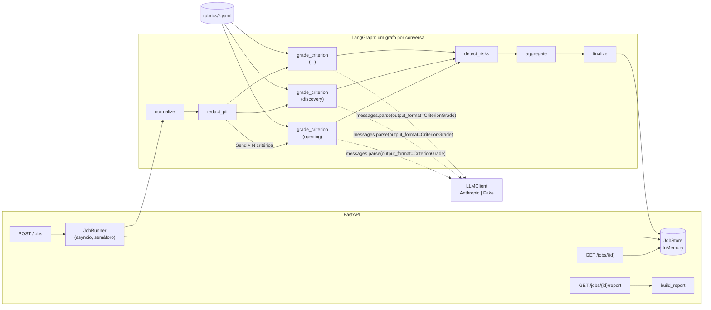

# conversation-grader

Pipeline de avaliação de qualidade de conversas (vendas e atendimento) com **LLM-as-judge**: recebe lotes de conversas, avalia cada uma por uma rubrica versionada, cita trechos como evidência, aponta riscos de conformidade e agrega tudo em um relatório por vendedor e por critério. Para times comerciais e de qualidade que precisam auditar 100% das conversas, não uma amostra.


---

## Caso de uso real

Em uma empresa do setor de energia, a liderança comercial revisava manualmente uma amostra ínfima das conversas que o time mantinha com leads via WhatsApp, chat e telefone. A revisão era lenta, subjetiva (cada gestor olhava coisas diferentes) e chegava tarde demais para corrigir comportamento: quando uma promessa indevida era descoberta, o contrato já estava assinado.

O padrão implementado aqui mudou isso. Cada conversa passa por um grafo de avaliação que normaliza o texto, **remove dados pessoais antes de qualquer chamada ao modelo**, avalia critérios objetivos em paralelo (abertura, descoberta de necessidade, tratamento de objeções, próximos passos, conformidade/promessas indevidas), exige que o juiz cite **trechos literais** como evidência e verifica se esses trechos realmente existem na conversa. Regras determinísticas de risco rodam em paralelo ao modelo, de modo que um alerta de "garantia de economia" nunca depende do humor do LLM.

O resultado foi a avaliação de 100% das conversas com critérios consistentes, ranking por vendedor e por critério, alertas de risco no mesmo dia e uma suíte de regressão de prompts que impede que um ajuste na rubrica degrade silenciosamente as notas. O mesmo núcleo foi reaproveitado para avaliar um agente de vendas automatizado por etapa de funil, trocando apenas a rubrica.

**Este repositório é uma reimplementação genérica, com dados sintéticos, do padrão aplicado em produção.** Nomes, conversas e números são fictícios; não há dependência de nenhum sistema interno.

## O que este projeto demonstra

- **LLM atrás de uma interface** (`LLMClient` Protocol) com implementação de produção (`AnthropicLLMClient`) e fake determinístico (`FakeLLMClient`) usado em testes e modo demo. Nenhum teste toca a rede.
- **Saída estruturada validada** via `client.messages.parse(..., output_format=CriterionGrade)` com pydantic, e **snapshot do JSON Schema** para garantir o contrato.
- **Grounding verificável**: pós-validação de evidências por substring normalizada; evidência inventada é marcada (`evidence_verified=False`) em vez de passar despercebida.
- **Privacidade por construção**: redação de CPF, telefone, e-mail e cartão antes do LLM, com contadores por tipo.
- **Orquestração com LangGraph**: estado tipado, fan-out por critério com `Send`, reducers para agregação, checkpointer em memória opcional.
- **Jobs assíncronos** com concorrência limitada, isolamento de falhas por conversa e store plugável (`JobStore` Protocol).
- **Observabilidade**: logging JSON estruturado, latência por critério, tokens e custo estimado por conversa e por job.
- **Regressão de prompts**: suíte `evals/` com nota esperada ± tolerância que falha o CI em caso de deriva.
- **Qualidade de engenharia**: ruff, pytest com 99% de cobertura, Docker multi-stage sem root, CI em GitHub Actions.

## Arquitetura



### Componentes

| Módulo | Responsabilidade |
|---|---|
| `grader/rubric.py` | Carrega e valida rubricas YAML (critérios, âncoras 0-5, pesos) com pydantic; `RubricRegistry` indexa por id. |
| `grader/pii.py` | Redação de PII por regex (CPF, telefone BR, e-mail, cartão) com contagem por tipo. |
| `grader/graph/` | Estado tipado (`GraderState`), nós e montagem do grafo LangGraph; `ConversationGrader` é a fachada síncrona/assíncrona. |
| `grader/llm/` | `LLMClient` Protocol, `AnthropicLLMClient` (SDK oficial) e `FakeLLMClient` (heurísticas lexicais determinísticas). |
| `grader/evidence.py` | Normalização e verificação de que cada evidência citada existe na conversa. |
| `grader/risks.py` | Regras determinísticas de risco (promessa indevida, urgência artificial, pedido de dado sensível, PII, nota baixa em conformidade). |
| `grader/aggregate.py` | Nota ponderada por conversa, custo estimado e relatório por critério/agente/risco. |
| `grader/jobs.py` | `JobStore` Protocol, `InMemoryJobStore` e `JobRunner` com concorrência limitada. |
| `grader/api.py` | FastAPI com injeção de dependências, autenticação por API key e limites de payload. |
| `grader/cli.py` | `grader run`, `grader eval`, `grader serve`. |
| `grader/evals.py` | Carregamento e execução da suíte de regressão de prompts. |

### Fluxo de uma requisição

1. `POST /jobs` valida o payload (pydantic, limites de tamanho, ids únicos, rubrica existente), cria o job com status `queued` e responde **202** imediatamente com `job_id`.
2. Uma `asyncio.Task` chama o `JobRunner`, que marca o job como `running` e dispara `ConversationGrader.agrade` para cada conversa sob um semáforo (`MAX_CONCURRENCY`).
3. Para cada conversa o grafo executa: `normalize` (limpa espaços, monta transcript `role: texto`) → `redact_pii` (substitui PII por `[CPF]`, `[PHONE]`, ...) → fan-out com `Send`, um ramo `grade_criterion` por critério da rubrica, cada um montando o prompt e chamando `LLMClient.parse_structured` → `detect_risks` (regras) → `aggregate` (nota ponderada, tokens, custo) → `finalize` (monta `ConversationResult`).
4. Cada resultado é persistido incrementalmente no `JobStore`; `GET /jobs/{id}` mostra progresso em tempo real. Falha em uma conversa não derruba o job: ela entra com `error` preenchido e `progress.failed` incrementado.
5. `GET /jobs/{id}/report` agrega os resultados existentes: média por critério, ranking por agente, top riscos por severidade e uso de tokens/custo.

### Decisões técnicas

| Decisão | Alternativa considerada | Por quê |
|---|---|---|
| Um nó `grade_criterion` com fan-out via `Send` | Um nó fixo por critério | A rubrica dita o número de ramos; adicionar um critério é editar YAML, não código. O reducer `operator.add` agrega as notas. |
| Evidência literal + verificação por substring normalizada | Confiar na citação do modelo | Alucinação de evidência é o principal risco de um juiz LLM. A verificação é barata e torna o resultado auditável. |
| Riscos por regras determinísticas, separados do juiz | Pedir ao LLM que liste riscos | Alertas de conformidade precisam ser reprodutíveis e baratos; regras complementam (não substituem) a nota de conformidade do juiz. |
| Redação de PII antes do LLM, com tokens | Enviar texto bruto e confiar no fornecedor | Minimização de dados: o modelo nunca recebe CPF/telefone; os tokens preservam o contexto ("Meu CPF é [CPF]"). |
| `FakeLLMClient` com heurísticas lexicais | Mock que devolve nota fixa | Notas plausíveis e variadas exercitam agregação, riscos e evals de forma realista, 100% offline e determinística. |
| `JobStore` como Protocol + `InMemoryJobStore` | Redis/Postgres desde o início | Mantém o projeto executável sem infraestrutura; a troca por Redis/Postgres é local ao módulo `jobs.py`. |
| Custo estimado a partir de `response.usage` | Ignorar custo | Em produção o custo por job é critério de aceite; preços são configuráveis por env. |
| `messages.parse` com `output_format` pydantic | `messages.create` + `json.loads` manual | O SDK valida o schema e devolve o objeto tipado em `parsed_output`; menos código e contrato explícito. |

## Como executar

### Pré-requisitos

- Python 3.12+ e [`uv`](https://docs.astral.sh/uv/) 0.9+
- Docker (opcional, para o modo container)

### Instalação

```bash
make dev            # uv sync (inclui dependências de desenvolvimento)
cp .env.example .env
```

O `.env.example` já vem com `USE_FAKE_LLM=true`: **o modo demo funciona sem nenhuma credencial**.

### Modo demo (CLI, sem credenciais)

```bash
uv run grader run examples/conversations.jsonl --rubric sales_v1 --fake
```

Saída esperada (8 conversas sintéticas em pt-BR; `*` marcaria evidência não verificada):

```
conversation  agent           overall  opening  discovery  objection_handling  next_steps  compliance  risks
------------  --------------  -------  -------  ---------  ------------------  ----------  ----------  ------------------------------------------
conv-001      vendedor-ana    5.00     5        5          5                   5           5           -
conv-002      vendedor-bruno  2.00     0        1          1                   1           5           -
conv-003      vendedor-bruno  2.07     5        2          1                   5           0           undue_promise,artificial_urgency
conv-004      vendedor-carla  4.36     5        4          3                   5           5           pii_shared
conv-005      bot-funil-v2    4.57     5        5          3                   5           5           -
conv-006      vendedor-carla  4.29     5        3          5                   3           5           -
conv-007      vendedor-ana    3.93     5        2          3                   5           5           pii_shared
conv-008      vendedor-bruno  1.00     0        1          3                   1           0           artificial_urgency,sensitive_data_request,low_compliance_score
(* = evidence not verified)

conversations=8 mean_overall=3.40
tokens: input=18217 output=1829 est_cost_usd=0.109448
top risks: undue_promisex1, sensitive_data_requestx1, low_compliance_scorex1, artificial_urgencyx2, pii_sharedx2
```

Use `-o json` para a saída completa (notas, justificativas, evidências, riscos e relatório agregado).

### Regressão de prompts

```bash
uv run grader eval --fake            # usa evals/sales_v1.yaml; exit code 1 se houver deriva
```

Com o cliente real (requer `ANTHROPIC_API_KEY`):

```bash
export ANTHROPIC_API_KEY=sk-ant-...
uv run grader eval --real
uv run grader run examples/conversations.jsonl --real
```

Cada caso em `evals/sales_v1.yaml` tem uma conversa, as notas esperadas por critério e uma tolerância (padrão ±1; casos de conformidade usam ±0). Ao ajustar a rubrica ou o prompt, rode a suíte com o cliente real antes de fazer merge; o CI roda a versão fake a cada push.

### API local

```bash
uv run grader serve --port 8000      # ou: make serve
```

Criar um job:

```bash
curl -s -X POST http://localhost:8000/jobs \
  -H 'Content-Type: application/json' \
  -d '{
    "rubric_id": "sales_v1",
    "conversations": [{
      "id": "conv-demo", "agent_id": "vendedor-ana", "channel": "whatsapp",
      "messages": [
        {"role": "agent", "text": "Olá, bom dia! Meu nome é Ana Exemplo, sou da equipe comercial. Tudo bem?"},
        {"role": "customer", "text": "Bom dia. Meu CPF é 000.000.000-00, quero uma simulação."},
        {"role": "agent", "text": "Não precisa enviar documentos por aqui. Qual é o seu consumo médio mensal?"},
        {"role": "customer", "text": "Uns 800 kWh."},
        {"role": "agent", "text": "Vou enviar a proposta hoje e agendar um retorno na sexta às 9h. Combinado?"},
        {"role": "customer", "text": "Combinado."}
      ]
    }]
  }'
# HTTP 202
# {"job_id":"3f1c...","status":"queued"}
```

Consultar status e resultados:

```bash
curl -s http://localhost:8000/jobs/3f1c... | jq '{status, progress, first: .results[0].criteria[0]}'
```

```json
{
  "status": "done",
  "progress": {"total": 1, "completed": 1, "failed": 0},
  "first": {
    "criterion_id": "opening",
    "criterion_name": "Abertura",
    "weight": 1.0,
    "score": 5,
    "rationale": "Abertura com saudacao e apresentacao.",
    "evidence": ["Olá, bom dia! Meu nome é Ana Exemplo, sou da equipe comercial. Tudo bem?"],
    "evidence_verified": true,
    "input_tokens": 512,
    "output_tokens": 48
  }
}
```

Relatório agregado e rubricas:

```bash
curl -s http://localhost:8000/jobs/3f1c.../report | jq '{mean_overall, by_agent, top_risks}'
curl -s http://localhost:8000/rubrics
```

Documentação interativa em `http://localhost:8000/docs`.

### Docker

```bash
make up        # docker compose up --build -d  (modo demo, porta 8000)
make down
```

A imagem final é multi-stage (`python:3.12-slim`), não contém `uv`, roda como usuário não-root e expõe `/health` para healthcheck. Para usar o cliente real no container, defina `USE_FAKE_LLM=false` e `ANTHROPIC_API_KEY` no ambiente do compose (nunca na imagem).

### Variáveis de ambiente

| Variável | Padrão | Descrição |
|---|---|---|
| `USE_FAKE_LLM` | `true` | `true` usa o juiz determinístico; `false` usa a API da Claude. |
| `ANTHROPIC_API_KEY` | — | Lida pelo SDK `anthropic`; nunca manipulada pelo código. |
| `LLM_MODEL` | `claude-opus-5-5` | Modelo do juiz (sem sufixo de data). |
| `LLM_MAX_TOKENS` | `16000` | `max_tokens` por chamada. |
| `LLM_INPUT_PRICE_PER_MTOK` / `LLM_OUTPUT_PRICE_PER_MTOK` | `4.0` / `20.0` | Preço por milhão de tokens para estimativa de custo. |
| `API_KEY` | — | Se definida, exige `X-API-Key` em todas as rotas exceto `/health`. |
| `MAX_CONCURRENCY` | `4` | Conversas avaliadas em paralelo por job. |
| `MAX_CONVERSATIONS_PER_JOB` / `MAX_MESSAGES_PER_CONVERSATION` | `200` / `500` | Limites de payload. |
| `RUBRICS_DIR` | `./rubrics` | Diretório das rubricas YAML. |
| `LOG_LEVEL` | `INFO` | Nível do logging JSON. |

## Testes

```bash
make test          # uv run pytest -q --cov=src --cov-report=term-missing
make lint          # ruff check + ruff format --check
```

Cobertura atual medida: **99%** (974 statements, 99 testes, ~6 s).

| Camada | O que cobre |
|---|---|
| **Unit** | Carregamento/validação de rubrica (âncoras, ids duplicados, YAML inválido), redação de PII (cada tipo, contagem, ausência de falsos positivos em valores de negócio), verificação de evidência (acentos, caixa, paráfrase), agregação (nota ponderada, custo, ranking), regras de risco, heurísticas do `FakeLLMClient` (determinismo e cada critério), formatter JSON. |
| **Integration** | Grafo completo com fake (conversa boa, conversa com promessa indevida, PII redigida antes do LLM via spy, evidência fabricada marcada, erro do LLM registrado sem derrubar o grafo, checkpointer, `ainvoke`); `JobRunner` (progresso, isolamento de falhas); API via `TestClient` (criar job → poll até `done` → relatório coerente com os resultados, 401/404/409/413/422); CLI via `CliRunner` (`run` tabela/JSON, `eval` passando e falhando, `--real` sem chave). |
| **Contract** | Snapshot do JSON Schema de `CriterionGrade` (`tests/snapshots/criterion_grade.schema.json`): qualquer mudança no contrato de structured output quebra o teste. `AnthropicLLMClient` testado contra um stub do cliente `anthropic` (monkeypatch), verificando a assinatura exata enviada ao SDK, tratamento de `stop_reason == "refusal"`, truncamento e `usage`. |

**Estratégia de fakes.** O `FakeLLMClient` recebe o mesmo prompt que o modelo real, extrai o critério e o transcript por marcadores e aplica heurísticas lexicais (saudação, perguntas abertas, acolhimento de objeção, encaminhamento com data, promessas e urgência). Isso produz notas variadas e evidências literais, o que exercita o pipeline inteiro de forma realista; para cenários adversariais (evidência inventada, recusa, erro), os testes injetam stubs próprios pelo mesmo Protocol.

## Segurança

- **Autenticação na borda**: `API_KEY` opcional via header `X-API-Key` (comparação simples; em produção, coloque atrás de um gateway com OAuth/JWT e TLS). `/health` é público por design.
- **Validação de entrada**: pydantic com `extra="forbid"`, limites de tamanho de texto, de mensagens por conversa e de conversas por job (413), ids únicos (422), rubrica existente (404).
- **Minimização de dados**: PII redigida antes de sair do processo; os tokens de redação ficam no estado para auditoria, o texto original não é logado.
- **Gestão de segredos**: `ANTHROPIC_API_KEY` é lida apenas pelo SDK; `.env` está no `.gitignore`; a imagem Docker não embute credenciais e roda como não-root.
- **Prompt injection**: o transcript vem de clientes e pode conter instruções ao modelo. A saída é estruturada e validada por schema (nota 0-5, evidência literal verificada), o que limita o dano a uma nota enviesada, que a suíte de evals e as regras determinísticas de risco ajudam a detectar.
- **Superfícies consideradas**: payloads grandes (limites), enumeração de jobs (ids UUID4 hex), erros do LLM (isolados por conversa), `stop_reason == "refusal"` tratado como erro de domínio.
- **Não coberto (honestamente)**: rate limiting, CORS, auditoria de acesso, rotação de chaves, persistência (jobs vivem em memória e somem ao reiniciar), criptografia em repouso, detecção de PII além de regex (nomes, endereços), e proteção contra prompt injection além da validação estrutural.

## Estrutura do projeto

```
conversation-grader/
├── src/grader/
│   ├── api.py               # FastAPI: /jobs, /jobs/{id}, /jobs/{id}/report, /rubrics, /health
│   ├── cli.py               # Typer: grader run | eval | serve
│   ├── config.py            # pydantic-settings (env vars)
│   ├── log.py               # logging JSON (stdlib)
│   ├── models.py            # Conversation, CriterionGrade (structured output), resultados, Job, Report
│   ├── rubric.py            # Rubric/Criterion + loader YAML + RubricRegistry
│   ├── pii.py               # redação de PII por regex
│   ├── evidence.py          # normalização e verificação de evidência
│   ├── prompts.py           # system prompt e prompt do juiz por critério
│   ├── risks.py             # regras determinísticas de risco
│   ├── aggregate.py         # nota ponderada, custo, relatório
│   ├── jobs.py              # JobStore Protocol, InMemoryJobStore, JobRunner
│   ├── evals.py             # suíte de regressão de prompts
│   ├── graph/
│   │   ├── state.py         # GraderState (TypedDict + reducers), GradeInput
│   │   ├── nodes.py         # normalize, redact_pii, fan-out, grade_criterion, detect_risks, aggregate, finalize
│   │   └── build.py         # build_graph() e ConversationGrader
│   └── llm/
│       ├── base.py          # LLMClient Protocol, LLMResult, LLMUsage, erros
│       ├── anthropic_client.py  # messages.parse(..., output_format=CriterionGrade)
│       └── fake.py          # FakeLLMClient determinístico
├── rubrics/sales_v1.yaml    # rubrica versionada (5 critérios, âncoras 0-5, pesos)
├── examples/conversations.jsonl  # 8 conversas sintéticas em pt-BR
├── evals/sales_v1.yaml      # casos de regressão (nota esperada ± tolerância)
├── tests/                   # unit, integration, contract (snapshot do schema)
├── Dockerfile               # multi-stage, sem uv, usuário não-root
├── docker-compose.yaml
├── Makefile                 # install, dev, test, lint, format, up, down, run, eval, serve
└── .github/workflows/ci.yml # ruff + pytest + eval fake em push/PR
```

## Roadmap / limitações conhecidas

- **Persistência**: `InMemoryJobStore` perde estado ao reiniciar. Evolução natural: `RedisJobStore` (TTL por job) ou Postgres (histórico e consultas por agente/período), implementando o mesmo `JobStore` Protocol.
- **Fila de trabalho**: jobs rodam em `asyncio.Task` no próprio processo da API. Para múltiplas réplicas, mover o `JobRunner` para um worker (Celery/Arq) consumindo de uma fila.
- **Juiz real**: o `AnthropicLLMClient` é síncrono e chamado em threads pelo `ainvoke` do LangGraph; uma versão `AsyncAnthropic` com retry/backoff explícito e prompt caching do system prompt reduziria latência e custo.
- **Calibração**: as heurísticas do fake aproximam, mas não substituem, a calibração do juiz real. A suíte `evals/` deve crescer com casos reais anonimizados e ser executada com `--real` antes de mudanças de rubrica.
- **Rubricas por canal/etapa de funil**: hoje há uma rubrica; o registry já suporta várias (`rubrics/*.yaml`), falta expor seleção por canal e versionamento semântico com depreciação.
- **PII**: regex cobre formatos estruturados; nomes e endereços exigiriam NER.
- **UI**: não há interface; o relatório é consumido via API/CLI.

## Licença

MIT. Copyright (c) 2026 Romeu Oliveira. Veja [LICENSE](LICENSE).
